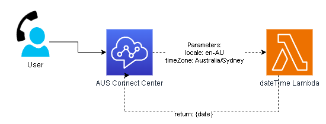
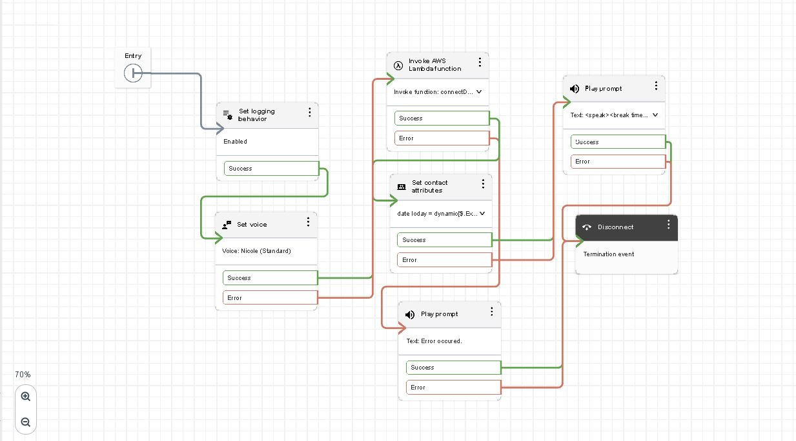

# Amazon Connect: DateTime Lambda Integration (CDK POC)

This project demonstrates a lightweight **Amazon Connect integration** using **AWS CDK (TypeScript)**.  
It provisions infrastructure to greet callers and respond with the current **localized date and time**.

---

## Features

- Greets the caller with the current **date and time** using SSML
- Automatically **associates the Lambda** with the Amazon Connect instance
- Fully deployable and repeatable via **AWS CDK**

---

## Stack Components

- `ConnectDateTime Lambda`  
  - Responds with the current date/time (formatted via `toLocaleString`)

- `AssociateConnectCustomLambda`  
  - Associates the above Lambda with your Amazon Connect instance using `connect:AssociateLambdaFunction`

- `Custom Resource`  
  - Ensures Lambda association is automated at deploy-time

---

## 📂 Project Structure

```
packages/
  infrastructure/
    lib/
      ausconnect-stack.ts         # Main CDK stack
    config.ts                     # Environment-specific config
  backend/
    lambdas/
      connectDateTime/            # Lambda that formats and returns the date
      connectAssociateLambda/     # Lambda that handles association logic
bin/
  ausconnect.ts                      # CDK app entrypoint
```

---

## Deploy Instructions

1. Configure your AWS CLI credentials:

```bash
aws configure
```

2. Bootstrap CDK (only once per environment):

```bash
npx cdk bootstrap
```

3. Install dependencies and build:

```bash
npm install
npm run build
```

4. Deploy the stack:

```bash
npx cdk deploy
```

---

## Configuration

Update `config.ts` to match your environment:

```ts
export const ausconnectConfig: AusconnectStackProps = {
  instanceId: '<your-connect-instance-id>',
  prefix: 'connectDemo',
  env: { account: '<your-aws-account>', region: 'eu-west-2' },
  defaultLocale: 'en-AU',
  defaultTimeZone: 'Australia/Sydney',
};
```
---

## High Level Architecture


---

## Example Connect  Flow



---

---

## 🧪 Example Lambda Output

```json
{
  "date": "18/04/2025, 6:47 pm"
}
```

---

## Issues Encountered
- Australian Phone number restriction
